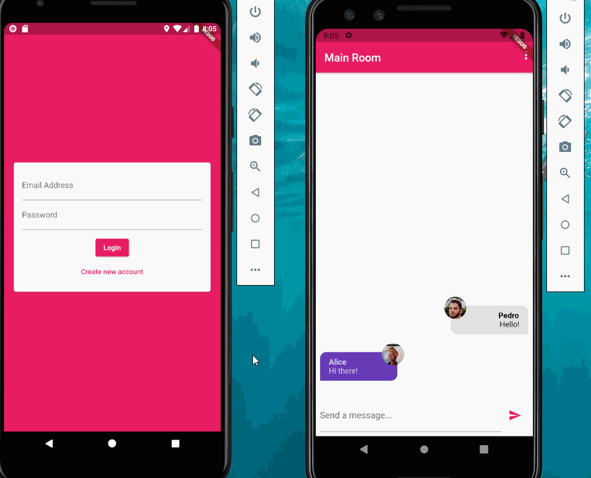

# Chat App

A basic chat app where many people can talk.

## Info

This project is build with flutter...

In this project you are able to log in and send messages into a group, and you get push notifications.

- You are able to log in and sign in to firebase
- You are able to add a profile picture
- You can see the messages from all the people
- Incoming and outgoing messages are separated where you see in the right your message 
and in the left other people messages
- You can see each user picture in the messages
- You can send messages
- You receive push notification if you are not on the app
- You can log out

## Video Walkthrough

Here's a walkthrough of implemented user stories:

GIF created with [LiceCap](http://www.cockos.com/licecap/). 

